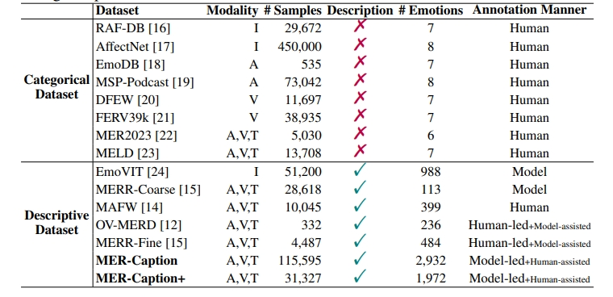

<h3 align="center"><a href="xxx" style="color:#9C276A">
Baselines for MER2025 Track1~Track3</a></h3>
<h5 align="center"> If our project helps you, please give us a star ⭐ on GitHub to support us. 🙏🙏 </h2>

<h5 align="center">


[](MER2025_Track1/LICENSE) 

</h5>


## 🛠️ Requirements and Installation
My Dependencies (We have not tested other envs):
* CUDA Version == 12.1

**[Environment Preparation]**
```bash
# we mainly depend on vllm2, but some baselines for Track2 and Track3 depend on whisperx
conda env create -f environment_vllm2.yml
conda env create -f environment_whisperx.yml
```

## 🚀 Dataset
In Hugging Face, we provide training datasets for Track1~Track3.
```bash
dataset
├── mer2025-dataset # Available at: https://huggingface.co/datasets/MERChallenge/MER2025
|   ├── video # all training data, including 132,171 samples
|   ├── audio # pre-extracted audio
|   ├── openface_face # # pre-extracted face files
|   ├── subtitle_chieng.csv # pre-extracted subtitle content
|   ├── track1_train_disdim.csv # training set for MER2025-Track1
|   ├── track2_train_mercaptionplus.csv # MER-Caption+ Dataset (OV labels for MER2025-Track2)
|   ├── track3_train_mercaptionplus.csv # MER-Caption+ Dataset (Description for MER2025-Track3)
|   ├── track2_train_ovmerd.csv # OV-MERD Dataset (OV labels for MER2025-Track2)
|   ├── track3_train_ovmerd.csv # OV-MERD Dataset (Description for MER2025-Track3)
|   ├── track_all_candidates.csv # Only useful for participants in MER2025 [all test samples exist in these candidates]
```


</p></details>

## ✨ Track1
We provide the training set in *track1_train_disdim.csv*, which contains *7,369* samples. Participants need to predict emotions of all samples in *track_all_candidates.csv*. More details are provided in the **./MER2025_Track1** folder.

## 👍 Track2 and Track3
we provide two training datasets, **OV-MERD** and **MER-Caption+** for these two tracks. Their dataset statistics are provided as below. More details are provided in the **./MER2025_Track23** folder.
<p></p>

<details open><summary>💡 Papers ✨. </summary><p>
<!--  may -->

> [**AffectGPT: A New Dataset, Model, and Benchmark for Emotion Understanding with Multimodal Large Language Models**](https://arxiv.org/abs/2501.16566) <br>
> Zheng Lian, Haoyu Chen, Lan Chen, Haiyang Sun, Licai Sun, Yong Ren, Zebang Cheng, Bin Liu, Rui Liu, Xiaojiang Peng, Jiangyan Yi, Jianhua Tao <br>

> [**OV-MER: Towards Open-Vocabulary Multimodal Emotion Recognition**](https://arxiv.org/abs/2410.01495) <br>
> Zheng Lian, Haiyang Sun, Licai Sun, Haoyu Chen, Lan Chen, Hao Gu, Zhuofan Wen, Shun Chen, Siyuan Zhang, Hailiang Yao, Bin Liu, Rui Liu, Shan Liang, Ya Li, Jiangyan Yi, Jianhua Tao <br>


## 📑 Citation

If you find AffectGPT useful for your research and applications, please cite using this BibTeX:
```bibtex
# MER-Caption dataset, MER-Caption+ dataset, AffectGPT Framework
@article{lian2025affectgpt,
  title={AffectGPT: A New Dataset, Model, and Benchmark for Emotion Understanding with Multimodal Large Language Models},
  author={Lian, Zheng and Chen, Haoyu and Chen, Lan and Sun, Haiyang and Sun, Licai and Ren, Yong and Cheng, Zebang and Liu, Bin and Liu, Rui and Peng, Xiaojiang and others},
  journal={arXiv preprint arXiv:2501.16566},
  year={2025}
}

# OV-MERD dataset
@article{lian2024open,
  title={Open-vocabulary Multimodal Emotion Recognition: Dataset, Metric, and Benchmark},
  author={Lian, Zheng and Sun, Haiyang and Sun, Licai and Chen, Lan and Chen, Haoyu and Gu, Hao and Wen, Zhuofan and Chen, Shun and Zhang, Siyuan and Yao, Hailiang and others},
  journal={arXiv preprint arXiv:2410.01495},
  year={2024}
}

# EMER task
@article{lian2023explainable,
  title={Explainable Multimodal Emotion Recognition},
  author={Lian, Zheng and Sun, Haiyang and Sun, Licai and Gu, Hao and Wen, Zhuofan and Zhang, Siyuan and Chen, Shun and Xu, Mingyu and Xu, Ke and Chen, Kang and others},
  journal={arXiv preprint arXiv:2306.15401},
  year={2023}
}

# MER2023 Dataset
@inproceedings{lian2023mer,
  title={Mer 2023: Multi-label learning, modality robustness, and semi-supervised learning},
  author={Lian, Zheng and Sun, Haiyang and Sun, Licai and Chen, Kang and Xu, Mngyu and Wang, Kexin and Xu, Ke and He, Yu and Li, Ying and Zhao, Jinming and others},
  booktitle={Proceedings of the 31st ACM international conference on multimedia},
  pages={9610--9614},
  year={2023}
}

# MER2024 Dataset
@inproceedings{lian2024mer,
  title={Mer 2024: Semi-supervised learning, noise robustness, and open-vocabulary multimodal emotion recognition},
  author={Lian, Zheng and Sun, Haiyang and Sun, Licai and Wen, Zhuofan and Zhang, Siyuan and Chen, Shun and Gu, Hao and Zhao, Jinming and Ma, Ziyang and Chen, Xie and others},
  booktitle={Proceedings of the 2nd International Workshop on Multimodal and Responsible Affective Computing},
  pages={41--48},
  year={2024}
}
```

## 🔒 License

This project is released under the Apache 2.0 license as found in the LICENSE file.
The service is a research preview intended for **non-commercial use ONLY**. Please get in touch with us if you find any potential violations.
