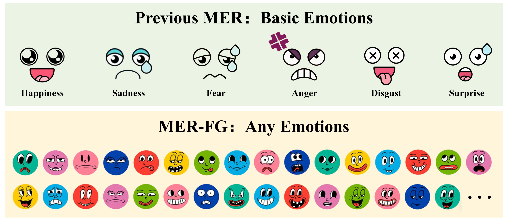

<div align="center">

# Track2 — MER-FG

### Baselines for Fine-grained Emotion Recognition

> This project builds upon our previous work on OV-MER and AffectGPT.
> Reference repository: [AffectGPT](https://github.com/zeroQiaoba/AffectGPT)

</div>

---

## Table of Contents

- [Task Description](#-task-description)
- [Dataset](#-dataset)
- [Evaluation Metric](#-evaluation-metric)
- [Zero-shot Baselines](#️-zero-shot-baselines)
- [AffectGPT (Post-training)](#-affectgpt-post-training)

---

## 📌 Task Description

MER-FG was first introduced at MER2024 and is now in its **third edition**. Human emotions encompass a vast vocabulary that extends far beyond the six basic labels used in traditional tasks. Confining emotional expression to a fixed label set leads to inaccurate representation. In this track, participants can predict **any number of emotion labels across any category** — including fine-grained and nuanced emotions — leveraging the vocabulary and multimodal understanding capabilities of MLLMs.

<div align="center">
  
  <p><em>MER-FG: Unlike previous MER tasks that focus on basic emotions, MER-FG extends the recognition scope to encompass any emotion category.</em></p>
</div>


---

## 🚀 Dataset

We provide two labeled training datasets:

| Dataset | Annotation Type | Samples |
|---|---|---|
| `track2_train_human.csv` (Human-OV) | Human-annotated  | 1,532 |
| `track2_train_mercaptionplus.csv` (MER-Caption+) | Auto-annotated | 31,327 |


```
dataset/
└── mer2026-dataset/                      # https://huggingface.co/datasets/MERChallenge/MER2026
    ├── video/                            # 132,171 samples
    ├── audio/                            # 132,171 samples
    ├── openface_face/                    # 132,171 samples
    ├── subtitle_chieng.csv               # Pre-extracted subtitles, 132,171 samples
    ├── track2_train_human.csv            # Human-annotated labels, 1,532 samples
    ├── track2_train_mercaptionplus.csv   # Auto-annotated labels, 31,327 samples
    └── track1_track2_candidate.csv       # 20,000 candidates
```

---

## 📏 Evaluation Metric

Since the label space is open, the evaluation uses an **Emotion Wheel-based (EW-based)** metric to handle synonyms and label variations.

**3-level grouping strategy:**
- **L1:** Normalize emotion words to their base form (e.g., *"angered"* → *"anger"*)
- **L2:** Map synonyms to a unified label (e.g., *"happy"* and *"joyful"* → *"happy"*)
- **L3:** Map outer-layer emotion wheel labels to their innermost basic category (using 5 emotion wheels)

**Final score:** Average F1-score across all 5 emotion wheels (higher is better).

---


## 🗝️ Zero-shot Baselines

### Preparation

```
dataset/
└── mer2026-dataset/
    ├── ...
    ├── track2_train_human.csv
    ├── track2_train_mercaptionplus.csv
    └── track1_track2_candidate.csv

MER2026_Track2/
└── models/   # Pre-trained weights: https://pan.baidu.com/s/1KHL1oGCtvqr8IMNWDWxH3Q?pwd=djjw
    ├── bert-base-uncased/
    ├── Chat-UniVi/
    ├── clip-vit-large-patch14/
    ├── LanguageBind_Image/
    └── ...
```

### Inference

**Step 1:** Generate descriptions and save to `./output/results-mer2026ov`

```bash
conda activate vllm3

cd Qwen-Audio
CUDA_VISIBLE_DEVICES=0 python main-audio.py --subtitle_flag='subtitle' --dataset='MER2026OV'

cd SALMONN
CUDA_VISIBLE_DEVICES=0 python main-audio.py --subtitle_flag='subtitle' --dataset='MER2026OV'

cd Video-ChatGPT
CUDA_VISIBLE_DEVICES=0 python main-video.py --subtitle_flag='subtitle' --dataset='MER2026OV'

cd Chat-UniVi
CUDA_VISIBLE_DEVICES=0 python main-video.py --subtitle_flag='subtitle' --dataset='MER2026OV'
```

```bash
conda activate whisperx

cd LLaMA-VID
CUDA_VISIBLE_DEVICES=0 python main-video.py --subtitle_flag='subtitle' --dataset='MER2026OV'

cd Video-LLaVA
CUDA_VISIBLE_DEVICES=0 python main-video.py --subtitle_flag='subtitle' --dataset='MER2026OV'
```

**Step 2:** Extract open-vocabulary labels from generated descriptions:
```bash
python ovlabel_extraction.py
```

---

## ✨ AffectGPT (Post-training)

### Preparation

```
MER2026_Track2/
└── models/                       
    ├── chinese-hubert-large/      # Audio encoder (HuggingFace: TencentGameMate/chinese-hubert-large)
    ├── clip-vit-large-patch14/    # Video encoder (HuggingFace: openai/clip-vit-large-patch14)
    └── Qwen2.5-7B-Instruct/       # LLM (HuggingFace: Qwen/Qwen2.5-7B-Instruct)
```

> Update the path placeholder in `config.py` — replace `xxx` with your own path.

### Training

```bash
# Model 1: Train on Human-OV data
CUDA_VISIBLE_DEVICES=0 python -u train.py \
  --cfg-path=train_configs/human_outputhybird_bestsetup_bestfusion_face_lz.yaml

# Model 2: Train on MERCaption+ data
CUDA_VISIBLE_DEVICES=0 python -u train.py \
  --cfg-path=train_configs/mercaptionplus_outputhybird_bestsetup_bestfusion_face_lz.yaml
```

### Inference

Results are saved to `./output/results-mer2026ov`.

```bash
# Model 1: Inference on Human-OV
CUDA_VISIBLE_DEVICES=0 python -u inference_hybird.py \
  --zeroshot \
  --dataset='MER2026OV' \
  --cfg-path=train_configs/human_outputhybird_bestsetup_bestfusion_face_lz.yaml \
  --options "inference.test_epochs=10-60" "inference.skip_epoch=5"

# Model 2: Inference on MERCaption+
CUDA_VISIBLE_DEVICES=0 python -u inference_hybird.py \
  --zeroshot \
  --dataset='MER2026OV' \
  --cfg-path=train_configs/mercaptionplus_outputhybird_bestsetup_bestfusion_face_lz.yaml \
  --options "inference.test_epochs=10-60" "inference.skip_epoch=5"
```

---

## 👍 Evaluation

```bash
# (description -> OV labels) + ground-truth labels => EW-based score
python evaluation.py
```
