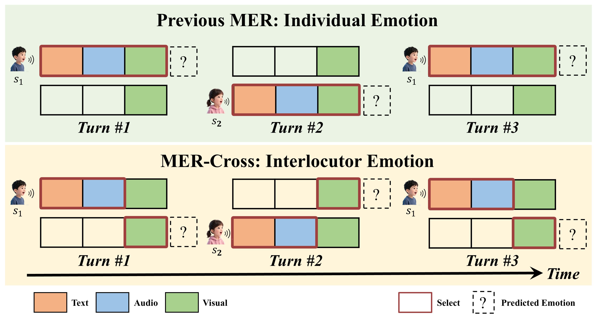
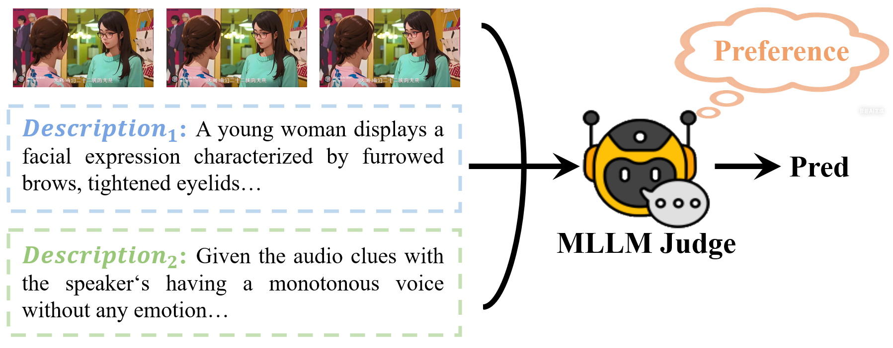

<div align="center">

# MER 2026: From Discriminative Emotion Recognition to Generative Emotion Understanding

### Official Baselines for Track1 ~ Track3

[](LICENSE) [](https://huggingface.co/datasets/MERChallenge/MER2026) [](https://zeroqiaoba.github.io/MER-Challenge/)

> If our project helps you, please give us a star ⭐ on GitHub to support us!

</div>

---

## Overview

MER2026 is the **fourth edition** of the MER challenge series, organized at ACM Multimedia 2026. Throughout its history, the MER challenge has steadily evolved from *discriminative emotion recognition* (fixed basic labels) toward *generative emotion understanding* (fine-grained, descriptive, and preference-based emotion modeling). The MER dataset has been downloaded over **20,000 times**, making it one of the largest emotion recognition challenges in the research community.

> Challenge website: https://zeroqiaoba.github.io/MER-Challenge/

---

## Table of Contents

- [Environment Setup](#️-environment-setup)
- [Dataset](#-dataset)
- [Track1: MER-Cross](#-track1-mer-cross-interlocutor-emotion)
- [Track2: MER-FG](#-track2-mer-fg-fine-grained-emotion)
- [Track3: MER-Prefer](#-track3-mer-prefer-emotion-preference)
- [License](#-license)

---

## 🛠️ Environment Setup

```bash
# Most models rely on this environment
conda env create -f environment_vllm3.yml

# Some zero-shot baselines rely on this environment
conda env create -f environment_whisperx.yml
```

---

## 🚀 Dataset

All training datasets for Track1–Track3 are available on Hugging Face.

```
dataset/
└── mer2026-dataset/                      # https://huggingface.co/datasets/MERChallenge/MER2026
    ├── video/                            # 132,171 samples
    ├── audio/                            # 132,171 samples
    ├── openface_face/                    # 132,171 samples
    ├── subtitle_chieng.csv               # Pre-extracted subtitles, 132,171 samples
    ├── track1_train.csv                  # Track1 training set (same-person), 9,395 samples
    ├── track2_train_human.csv            # Track2 training set (human-annotated), 1,532 samples
    ├── track2_train_mercaptionplus.csv   # Track2 training set (auto-annotated), 31,327 samples
    ├── track1_track2_candidate.csv       # 20,000 candidates for Track1 & Track2
    ├── track3_emoprefer.csv              # Track3 EmoPrefer-Data (major vote), 574 samples
    ├── track3_emopreferv2.csv            # Track3 EmoPrefer-Data-V2 (single annotator), 2,096 samples
    └── track3_candidate.csv              # 10,000 candidates for Track3
```

---

## ✨ Track1: MER-Cross (Interlocutor Emotion)

MER-Cross is a **newly introduced track** that shifts the focus from individual scenarios to **dyadic interactions**. In a dyadic conversation, two speakers (s₁ and s₂) take turns. While previous MER tasks focused on the speaking person's emotions (s₁), MER-Cross targets the **interlocutor's emotions** (s₂ — the listener). This enables capturing emotional states of both participants in dynamic interaction scenarios.

<div align="center">
  
  <p><em>MER-Cross: Unlike previous tasks that focus on isolated speakers, we aim to predict the emotions of interlocutors, capturing both speakers' emotional states in dynamic interaction scenarios.</em></p>
</div>

- **Training set:** `track1_train.csv` — 9,395 samples with *individual* emotions
- **Candidate set:** `track1_track2_candidate.csv` — 20,000 samples to predict
- **Evaluation metric:** Weighted Average F1-score (WAF); 6 categories: *neutral, anger, happiness, sadness, worry, surprise*

> More details and baselines: [./MER2026_Track1](./MER2026_Track1)

---

## 👍 Track2: MER-FG (Fine-grained Emotion)

MER-FG was first introduced at MER2024 and is now in its **third edition**. Unlike tasks restricted to fixed basic labels, MER-FG allows participants to predict **any number of emotion labels across diverse categories**, enabling fine-grained and nuanced emotion understanding powered by MLLMs.

<div align="center">
  
  <p><em>MER-FG: Unlike previous MER tasks that focus on basic emotions, MER-FG extends the recognition scope to encompass any emotion category.</em></p>
</div>

Two training datasets are provided:

| Dataset | Annotation | Samples |
|---|---|---|
| `track2_train_human.csv` (Human-OV) | Human-annotated | 1,532 |
| `track2_train_mercaptionplus.csv` (MER-Caption+) | Auto-annotated | 31,327 |

- **Candidate set:** `track1_track2_candidate.csv` — 20,000 samples to predict
- **Evaluation metric:** Emotion Wheel-based (EW-based) average F1-score across 5 emotion wheels

> More details and baselines: [./MER2026_Track2](./MER2026_Track2)

---

## 👍 Track3: MER-Prefer (Emotion Preference)

MER-Prefer is a **newly introduced track** based on the EmoPrefer concept. Given a video and two emotion descriptions, the model must determine **which description is preferred by human annotators**. This task is crucial for training reward models capable of genuine emotion understanding.

<div align="center">
  
  <p><em>MER-Prefer: Given a video, the model needs to determine which emotion description is preferred by humans.</em></p>
</div>

Two training datasets are provided:

| Dataset | Annotation | Samples |
|---|---|---|
| `track3_emoprefer.csv` (EmoPrefer-Data) | Major vote (3 annotators) | 574 |
| `track3_emopreferv2.csv` (EmoPrefer-Data-V2) | Single annotator | 2,096 |

- **Candidate set:** `track3_candidate.csv` — 10,000 pairs to predict
- **Evaluation metric:** Weighted Average F1-score (WAF) on 2-class preference classification

> More details and baselines: [./MER2026_Track3](./MER2026_Track3)

---

## 🔒 License

This project is released under the [Apache 2.0 License](LICENSE). The service is a research preview intended for **non-commercial use ONLY**. Please get in touch with us if you find any potential violations.
